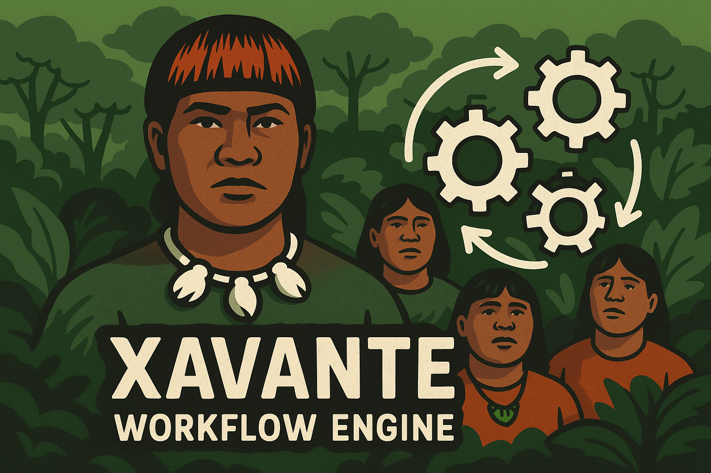

# Xavante Workflow Engine

[](https://opensource.org/licenses/MIT)
[](https://www.php.net/)
[](https://phpunit.de/)

**Xavante** is a powerful, self-contained PHP workflow engine library for modeling, testing, and executing versioned workflows. Built with a focus on deterministic state machines, JSON-first serialization, and comprehensive testing capabilities.

## 🌟 Why Xavante?

Originally conceived in 2005 and presented at a technology event in Brazil, Xavante began as an experimental effort to build a compact, deterministic workflow engine. After a long pause, development was resumed in 2024: the revival preserves the original name and core concepts while focusing on modernization — updating the codebase for modern PHP (8.2+), adding Docker-based development, expanding automated tests, and clarifying the dual-model architecture, factory patterns and operator system. The 2024 effort started as an individual initiative by the original author and is intended to grow into a community-driven project; contributors and volunteers are welcome to help improve features, documentation, and the broader ecosystem (dashboard, worker, designer, API).

**Empowering Applications with User-Configurable Workflows**

The main purpose of the Xavante workflow engine is to enhance application capabilities by offering custom functionalities that don't necessarily require building code components to make them work. This reduces dependency on developers and enables users to create their own flows within the capabilities offered by target applications.

**Real-World Benefits:**
- **CRM Applications**: Instead of maintaining huge backlogs of automation features, engineering teams can provide workflow templates that perform operations according to business design
- **Flexible Versioning**: Create different versions with varying characteristics, or remove parts of flows by simply modifying templates
- **End-User Empowerment**: Applications can allow end users to modify workflow parts, adding extra flexibility to projects
- **Framework Agnostic**: Works seamlessly with any PHP framework (Laravel, Symfony, CodeIgniter) or as standalone scripts
- **Reduced Development Overhead**: Business logic changes don't require code deployments—just template updates

## 📖 About the Name

This project is named **Xavante** ("sha-VAHN-chee") as a tribute to the strength, structure, and resilience of the Xavante people of Brazil. Despite enduring persecution and displacement, they preserved their identity, traditions, and wisdom. Their dual clan system, sacred decision-making spaces, and powerful initiation rituals reflect a deep cultural logic—rooted in balance, endurance, and community.

By choosing this name, I hope to honor their memory and legacy, and acknowledge the strength of Indigenous knowledge systems that continue to inspire, even in the world of modern technology. This is a gesture of respect—for a people whose cultural richness deserves to be remembered and celebrated.

## 🎯 Framework Integration

Xavante Core is designed to integrate seamlessly with any PHP environment:

- **Laravel/Lumen**: Service provider and facade support
- **Symfony**: Bundle integration with dependency injection
- **CodeIgniter**: Library integration with CI hooks
- **Standalone Scripts**: Direct composer autoloading
- **Legacy Applications**: Drop-in compatibility with existing codebases

## 🚀 Features

- **Dual Model Architecture**: Immutable workflow templates and stateful runtime instances
- **JSON-First Design**: Complete serialization/deserialization of workflows
- **Deterministic State Machines**: Guards, conditions, and role-based transitions
- **Comprehensive Action System**: Entry/exit/transition tasks with retry policies
- **Rich Operator Library**: 20+ operators for conditions and guards
- **Factory Pattern**: Type-safe object creation with validation
- **Docker Development**: Containerized development environment
- **Extensive Testing**: Unit, integration, and use-case test suites

## 📦 Installation

```bash
composer require xavante/core
```

## 🏗️ Architecture Overview

### Core Components

```
┌─────────────────────────────────────────────────────────────┐
│                    Xavante Workflow Engine                   │
├─────────────────────────────────────────────────────────────┤
│  Domain Models (Templates)     │  Runtime Models (Instances) │
│  ├── Workflow                  │  ├── Process                │
│  ├── State                     │  ├── ProcessHistory         │
│  ├── Transition               │  └── RuntimeContext         │
│  ├── Event                    │                             │
│  └── Variable                 │                             │
├─────────────────────────────────────────────────────────────┤
│                     Execution Engine                         │
│  ├── Processor (State Machine Engine)                       │
│  ├── Actions (Entry/Exit/Transition Tasks)                  │
│  └── Conditions (Guards & Operators)                        │
└─────────────────────────────────────────────────────────────┘
```

### Dual Model Architecture

**Domain Models** (`src/Models/Domain/`)
- **Immutable workflow templates** that define the structure
- `Workflow`: Container with states, transitions, events, variables
- `State`: Nodes with entry/exit tasks and type (initial/intermediate/final)  
- `Transition`: Event-triggered edges with guards and source→target states

**Runtime Models** (`src/Models/Runtime/`)
- **Stateful execution instances** that track running workflows
- `Process`: Running workflow instance with active states, variables, history
- Maintains execution context and audit trail

## 🎯 Quick Start

### 1. Create Your First Workflow

```php
<?php
require_once 'vendor/autoload.php';

use Xavante\Models\Factories\WorkflowFactory;
use Xavante\Models\Factories\StateFactory;
use Xavante\Models\Factories\TransitionFactory;

// Create workflow
$workflow = WorkflowFactory::createWorkflow([
    'id' => 'simple-approval-v1',
    'name' => 'Simple Approval Workflow',
    'description' => 'A basic approval process'
]);

// Add states
$workflow->addState(StateFactory::createFromArray([
    'id' => 'draft',
    'name' => 'Draft', 
    'type' => 'initial',
    'entryTasks' => ['initContext']
]));

$workflow->addState(StateFactory::createFromArray([
    'id' => 'pending-approval',
    'name' => 'PendingApproval',
    'type' => 'intermediate',
    'entryTasks' => ['assignReviewer']
]));

$workflow->addState(StateFactory::createFromArray([
    'id' => 'approved',
    'name' => 'Approved',
    'type' => 'final',
    'entryTasks' => ['notifyRequester']
]));

// Add transitions
$workflow->addTransition(TransitionFactory::createFromArray([
    'sourceState' => 'draft',
    'targetState' => 'pending-approval', 
    'eventName' => 'submit'
]));

$workflow->addTransition(TransitionFactory::createFromArray([
    'sourceState' => 'pending-approval',
    'targetState' => 'approved',
    'eventName' => 'approve',
    'guards' => [
        ['variable' => 'user.role', 'operator' => 'equals', 'value' => 'manager']
    ]
]));
```

### 2. Execute the Workflow

```php
use Xavante\Runtime\Processor;
use Xavante\Models\Runtime\Process;

// Create process instance
$process = new Process($workflow);

// Execute workflow
$processor = new Processor();

// Submit for approval
$processor->processEvent($process, 'submit', ['requestId' => 'req-123']);

// Approve (with manager role)
$processor->processEvent($process, 'approve', [
    'user' => ['role' => 'manager'],
    'comment' => 'Approved by manager'
]);

// Check final state
echo $process->getCurrentState(); // 'approved'
```

### 3. JSON Export/Import

```php
// Export to JSON
$json = $workflow->jsonSerialize();
file_put_contents('workflow.json', $json);

// Import from JSON  
$data = json_decode(file_get_contents('workflow.json'), true);
$importedWorkflow = WorkflowFactory::createFromJson($data);
```

## 🧩 Designing Workflows

### State Types

- **Initial**: Entry point (one per workflow)
- **Intermediate**: Regular operational states
- **Final**: Terminal states with no outgoing transitions

### Actions and Tasks

Actions can be executed at three points:

- **Entry Tasks**: Run when entering a state
- **Exit Tasks**: Run when leaving a state  
- **Transition Tasks**: Run during state transition

```php
$state = StateFactory::createFromArray([
    'id' => 'processing',
    'entryTasks' => ['startTimer', 'notifyUser'],
    'exitTasks' => ['stopTimer', 'auditLog']
]);
```

### Guards and Conditions

Use guards to make transitions conditional:

```php
use Xavante\Conditions\Operators\OperatorConstants;

$transition = TransitionFactory::createFromArray([
    'sourceState' => 'pending',
    'targetState' => 'approved', 
    'eventName' => 'approve',
    'guards' => [
        ['variable' => 'amount', 'operator' => OperatorConstants::LESS_THAN, 'value' => 10000],
        ['variable' => 'user.role', 'operator' => OperatorConstants::EQUALS, 'value' => 'manager']
    ]
]);
```

### Available Operators

| Category | Operators | Example |
|----------|-----------|---------|
| **Comparison** | `equals`, `not_equals`, `greater_than`, `less_than`, `>=`, `<=` | `amount > 1000` |
| **Logical** | `is_empty`, `is_not_empty`, `is_true`, `is_false`, `is_null` | `comment != empty` |
| **String** | `contains`, `starts_with`, `ends_with`, `matches_regex` | `email contains '@company.com'` |
| **Date** | `before_date`, `after_date`, `between_dates` | `created_date > '2024-01-01'` |

## 📋 Use Cases

### 1. Simple Approval Workflow
**Scenario**: Single-step approval with role-based guards
- States: Draft → PendingApproval → Approved/Rejected
- Guards: Only managers can approve
- Actions: Auto-assignment, notifications, audit trail

### 2. Approval with Timer
**Scenario**: Time-bounded approvals with escalation
- States: Draft → PendingApproval → Escalated → Approved/Rejected/Expired
- Timer Events: Auto-escalation after 24 hours
- Actions: Email reminders, escalation notifications

### 3. Order Saga with Compensations
**Scenario**: Multi-service transaction coordination
- States: Payment → Inventory → Shipping → Completed/Failed
- Compensations: Auto-rollback on failures (refunds, stock release)
- Actions: Service calls, compensation orchestration

### 4. Support Ticket Lifecycle
**Scenario**: Customer support workflow with SLA tracking
- States: New → Assigned → InProgress → Resolved → Closed
- SLA Monitoring: Response time tracking, escalation triggers
- Actions: Auto-assignment, priority updates, customer notifications

### 5. Payment Processing
**Scenario**: Multi-step payment with fraud detection
- States: Initiated → Validated → Authorized → Captured/Failed
- Fraud Checks: Risk scoring, manual review triggers
- Actions: Payment gateway calls, fraud analysis, notifications

## 🛠️ Development Setup

### Docker Environment (Recommended)

```bash
# Clone and enter directory
git clone <repository-url>
cd xavante-core

# Start development environment
docker compose up -d

# Run tests
docker compose exec app vendor/bin/phpunit

# Access shell for debugging
docker compose exec app sh
```

### Local Development

```bash
# Install dependencies
composer install

# Run tests
./vendor/bin/phpunit

# Run specific test suite
./vendor/bin/phpunit --testsuite="Unit Tests"

# Generate coverage report
./run-coverage.sh
```

## 🧪 Testing

Comprehensive test suite with three levels:

```bash
# Unit Tests - Test components in isolation
./vendor/bin/phpunit tests/Unit/

# Integration Tests - Test component interactions  
./vendor/bin/phpunit tests/Integration/

# Use Case Tests - End-to-end scenarios
./vendor/bin/phpunit tests/Integration/UseCases/
```

### Test Structure

```
tests/
├── Unit/                    # Mock dependencies, isolated testing
│   ├── Models/             # Domain model unit tests
│   ├── Runtime/            # Processor unit tests
│   └── Conditions/         # Operator unit tests
├── Integration/            # Real component interactions
│   ├── Actions/           # Action integration tests
│   └── UseCases/          # Complete workflow scenarios
└── fixtures/              # Test data and workflow definitions
```

## 📖 API Reference

### Core Classes

| Class | Purpose | Usage |
|-------|---------|-------|
| `WorkflowFactory` | Create workflow instances | `WorkflowFactory::createWorkflow($data)` |
| `StateFactory` | Create state instances | `StateFactory::createFromArray($stateData)` |
| `TransitionFactory` | Create transition instances | `TransitionFactory::createFromArray($transitionData)` |
| `Processor` | Execute workflow instances | `$processor->processEvent($process, 'eventName')` |
| `OperatorRegistry` | Access condition operators | `OperatorRegistry::get('equals')->evaluate($a, $b)` |

### Value Objects

| Class | Purpose |
|-------|---------|
| `Id` | Auto-generating unique identifiers |
| `States` | Immutable state collection |
| `Transitions` | Immutable transition collection |  
| `Variables` | Workflow variable container |
| `Events` | Event collection and metadata |

## 🤝 Contributing

1. Fork the repository
2. Create a feature branch (`git checkout -b feature/amazing-feature`)
3. Write tests for your changes
4. Ensure all tests pass (`docker compose exec app vendor/bin/phpunit`)
5. Commit your changes (`git commit -m 'Add amazing feature'`)
6. Push to the branch (`git push origin feature/amazing-feature`)
7. Open a Pull Request

### Development Guidelines

- **Factory Pattern**: Always use factories for object creation
- **JSON-First**: Ensure all domain objects are JSON serializable
- **Immutability**: Domain models should be immutable after creation
- **Testing**: Write unit tests with mocked dependencies
- **Documentation**: Update README and use-case docs for new features

## 📄 License

This project is licensed under the MIT License - see the [LICENSE](LICENSE) file for details.

## 👥 Authors

- **Eduardo Luz** - [Personal site](https://www.eduardo-luz.com)

## 🌐 Xavante Ecosystem

**Xavante Core** is the foundational component of a comprehensive workflow management ecosystem. Other components are currently in planning or early development:

### � In Development

| Component | Status | Description |
|-----------|--------|-------------|
| **Xavante Dashboard** | 📋 *Planning* | Web-based management interface for workflows, processes, and analytics |
| **Xavante Worker** | ⚙️ *Early Development* | Background service for executing workflow instances at scale |
| **Xavante Designer** | 🎨 *Planning* | Visual drag-and-drop workflow designer with real-time validation |
| **Xavante API** | 🔌 *Planning* | RESTful API orchestrator for workflow lifecycle management and storage |

### 🎯 Roadmap Vision

The complete Xavante ecosystem will provide:
- **Visual Design**: Drag-and-drop workflow creation
- **Centralized Management**: Dashboard for monitoring and analytics
- **Scalable Execution**: Distributed worker infrastructure
- **API Integration**: RESTful services for workflow operations
- **Enterprise Features**: Multi-tenancy, RBAC, audit trails

### 🤝 Get Involved

Interested in contributing to the ecosystem? Join our community:
- 🐛 Report issues and suggest features
- 💡 Contribute to design discussions
- 🧪 Help with testing and documentation
- 🚀 Build integrations and extensions

---

**Xavante** - Empowering applications with user-configurable workflows since 2024 🚀